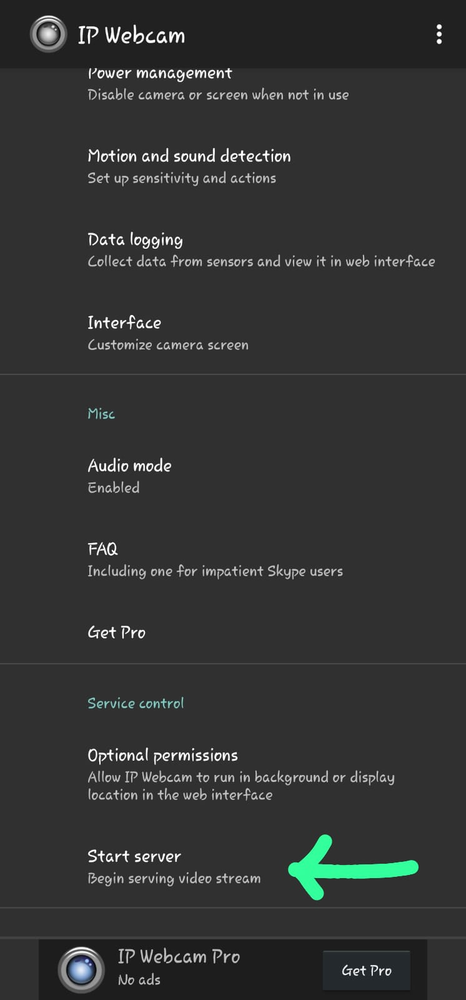

# Roy's-CALIBRATION :camera:

A pyhton package for calibration of RGB camera for robotics vision, mobile camera using Aruco

## Documentation

Wait to check out the [documentation](https://Roy's-CALIBRATION.readthedocs.io/en/latest/).

## Installation
Clone the Repository

```bash
git clone https://github.com/UK-Roy/camera-calibration-aruco.git
```

Go to the Directory 
```bash
cd path/to/camera-calibration-aruco
```

Install All the Libraries and Dependencies
```bash
pip install -r requirements.txt
```

## Usage

## Online Camera Calibration

### Step 1
Install the IP camera app in the device


### Step 2 
Open the app and press ```start server``` and note down the IP address of your camera in the bottom of the screen


### Step 3
Open terminal and write down the command
```python
python calibration_aruco.py -u "http://192.168.0.114:8080" -dir "path/to/save-image-directory" -y "path/to/output" --online
```

### Step 4
After a window will come up. Then open the aruco_marker_board.pdf file. It is Recommened to print this board and use this file. If you do not use this board you have to adjust some changes in the code.

### Step 5
Aim your camera to the board and capture image by pressing `c` in the keyboard
- If the window is freezed then the image is captured
- Want to caputure more image then again press `c` to unfreeze and again press `c` to capture another image
- When at the freeze mode if you press `q` the calibration will start.

### Step 6
You will see the camera matrix in the terminal and also get the yaml file at the desired location


## Offline Camera Calibration (You have the directory of images)

### Step 1
Open terminal and write down the command
```python
python calibration_aruco.py -dir "path/to/save-image-directory" -y "path/to/output" -no--online
```

### Step 2
You will see the camera matrix in the terminal and also get the yaml file at the desired location


## Add acknowledgments

### Ab abakisita

    https://github.com/abakisita/camera_calibration.git

### Asadullah Dal
    
    https://github.com/Asadullah-Dal17/Mobile-camera-for-Opencv-Python-.git


## Citation

Cite as

```bib
@article{roy2023calibration,
  title        = {{Roy's-CALIBRATION: An Open-Source RGB camera calibration package}},
  author       = {Utsha Kumar Roy},
  year         = 2023,
}
```
## Or
If you find this useful you can buy me a coffee :grinning:.  
